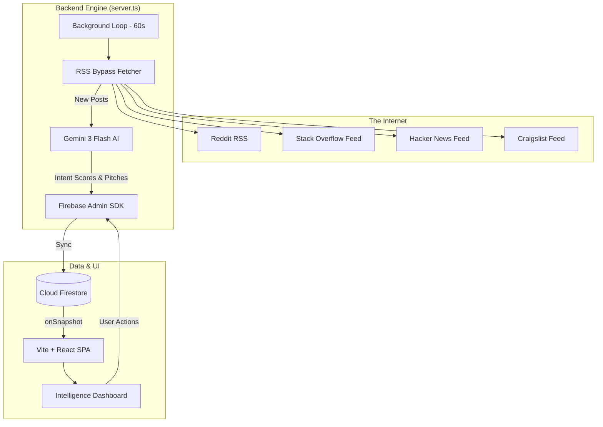

# IntentFirstHunter: AI-Driven Intent Discovery Engine

IntentFirstHunter is a high-performance lead generation platform designed to move beyond simple keyword matching. It utilizes **Google’s Gemini 3 Flash AI** to scan social platforms (Reddit, Stack Overflow, Hacker News, Craigslist) for real-time "intent signals"—identifying users who are actively seeking solutions rather than just mentioning keywords.

---

## 🏗️ System Architecture

The application is built on a "Real-time Intelligence Loop" where background workers, AI models, and live dashboards operate in a continuous cycle.



---

## 🧠 The "Brain": AI Scrutiny Logic

While traditional scrapers look for `keyword == "plumber"`, IntentFirstHunter looks for **Intent**.

### How the Machine "Thinks"
When a post is fetched, it is sent to **Gemini 3 Flash** in optimized batches. The machine is programmed to look for specific behavioral signals:
1.  **Explicit Requests**: "Can anyone recommend a service for...?"
2.  **Pain Points**: "I'm so frustrated with my current [Solution]..."
3.  **Exploratory Questions**: "Does anyone know how to solve [Problem X]?"
4.  **High-Intent Phrases**: "What is the best [X] for [Y]?"

### Scoring Algorithm
*   **1-3 (Cold)**: General discussion, news, or unrelated content.
*   **4-6 (Warm)**: Vague interest or early-stage research.
*   **7-10 (Hot)**: High-intent lead. The user is actively seeking a solution *now*.

### Automated Pitch Generation
For every lead with a score of 7+, the AI generates a **personalized WhatsApp pitch**. 
- It contextually understands the user's problem.
- It drafts a 2-sentence value proposition targeted at the business owner.
- It leaves placeholders for the business owner to easily send the message via the WhatsApp API.

---

## ⚙️ The Backend Engine

The backend is a robust Node.js server powered by **Express** and **Hono-style routing**, serving as a bridge between the browser and the raw internet.

### 1. The RSS Bypass Technique
Platforms like Reddit have strict IP blocking for standard scrapers. IntentFirstHunter bypasses this by:
*   Using **RSS Feeds** instead of the JSON API.
*   Routing requests through **rss2json** and standard RSS parsers to distribute request footprints.
*   Implementing **Randomized Delays** (1s - 3s) between platform fetches to mimic human interaction.

### 2. Background Persistence Loop
The server runs a `setInterval` worker every 60 seconds.
- It identifies "Active" scrapers.
- It calculates the `nextRun` based on the user-defined interval.
- It executes the `executeScraper` function, which handles the full pipeline: Fetch -> Batch -> Score -> Save.

---

## 🎨 The (Frontend) Dashboard

The frontend is a **Vite-powered React SPA** built for speed and visual clarity.

-   **State Management**: Uses a custom `DataProvider` with React Context. It maintains a **real-time WebSocket-like connection** to Firestore using the `onSnapshot` listener. As soon as the backend identifies a lead, it "pops" onto the user's screen without a refresh.
-   **Data Visualization**: Uses **Recharts** to process raw lead data into trend lines (Lead Velocity) and distribution charts (Scraper Health).
-   **Security**: Minimalist design with **Firebase Auth** guarding access, ensuring each user only sees their own intelligence data.

---

## 🚀 The User Flow: From Search to Sale

### 1. Initializing the Engine
When a user clicks **"Add Scraper"**, they aren't just setting up a search; they are configuring a digital hunter.
- **Client Name**: Who is the lead for?
- **Ideal Customer Profile**: What does a "perfect lead" look like to the AI?
- **Target**: Which "hunting grounds" should the engine monitor?

### 2. Identifying the Opportunity
When a lead is found:
- The backend writes the lead to Firestore.
- The UI triggers an animation in the **"System Activity"** feed.
- The **Lead Score** and **AI Reason** appear, explaining *why* the machine thinks this is a match.

### 3. Closing the Deal
Within the **Lead View**, the user can:
- Review the raw post content.
- See the AI's logic.
- Click **"Send WhatsApp"**: This opens a pre-composed message in a new tab, ready for the business owner to hit "Send".

---

## 🛠️ Technical Stack

-   **Frontend**: React 18, Vite, Tailwind CSS, Lucide icons.
-   **Charts**: Recharts (High-performance SVG charting).
-   **Backend**: Node.js, Express, Google Generative AI (Gemini Flash).
-   **Database**: Google Firebase (Firestore + Authentication).
-   **RSS Logic**: `rss-parser`, `node-fetch`.

---

## 📦 Getting Started

1.  **Environment Variables**: Create a `.env` with:
    ```env
    LEAD_SCORER_API_KEY=your_gemini_api_key
    FIREBASE_SERVICE_ACCOUNT=your_service_account_json
    ```
2.  **Install Dependencies**: `npm install`
3.  **Run Development**: `npm run dev` (Starts both the backend engine and the Vite server).
4.  **Production**: `npm run build && npm start`
