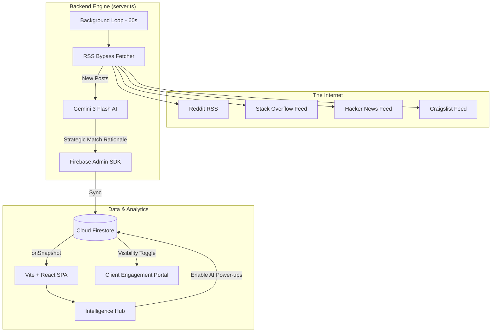

Preemptly is a high-performance **Real-time Growth Intelligence platform** designed to identify and intercept business opportunities the millisecond they appear online. It utilizes **Proprietary AI Scrutiny** to scan social platforms (Reddit, Stack Overflow, Hacker News, Craigslist) for high-intent signals—identifying users who are actively inquiring about solutions and providing a dedicated **Client Engagement Portal** for seamless community interaction.

---

## 🏗️ System Architecture

The application is built on a "Real-time Intelligence Loop" where background workers, AI models, and live dashboards operate in a continuous cycle.



---

## 🧠 The "Brain": AI Scrutiny Logic

While traditional scrapers look for `keyword == "plumber"`, Preemptly looks for **Intent**.

### How the Machine "Thinks"
When a post is discovered, it is sent to **Our Intent Scoring Engine** in optimized batches. The machine is programmed to look for specific behavioral signals:
1.  **Explicit Requests**: "Can anyone recommend a service for...?"
2.  **Pain Points**: "I'm so frustrated with my current [Solution]..."
3.  **Exploratory Questions**: "Does anyone know how to solve [Problem X]?"
4.  **High-Intent Phrases**: "What is the best [X] for [Y]?"

### Scoring Algorithm
*   **1-3 (Cold)**: General discussion, news, or unrelated content.
*   **4-6 (Warm)**: Vague interest or early-stage research.
*   **7-10 (Hot)**: High-intent lead. The user is actively seeking a solution *now*.

### ⚡ Strategic Match Intelligence
Every match discovered undergoes a **Strategic Rationale** calculation.
- **Provider View**: Explains exactly *why* the match was flagged based on the client's business profile.
- **Client View**: A simplified, professional justification for the match to build trust in the automated lead hunt.

### 🪄 On-Demand "Smart Helper" Comments
Preemptly avoids aggressive "Cold DMs." Instead, it enables high-trust community engagement.
- **Master AI Toggle**: Providers control AI costs by enabling/disabling generative features for clients in real-time.
- **Smart Comments**: When enabled, clients can generate a **Context-Aware Helpful Comment** for any match, tailored to their business tone and specific expertise.
- **Actionable Workflow**: Clients review the match, generate a comment, and use the **"One-Click Copy"** to engage on the source platform instantly.

---

## ⚙️ The Backend Engine

The backend is a robust Node.js server powered by **Express** and **Hono-style routing**, serving as a bridge between the browser and the raw internet.

### 1. The RSS Bypass Technique
Platforms like Reddit have strict IP blocking for standard scrapers. Preemptly bypasses this by:
*   Using **RSS Feeds** instead of the JSON API.
*   Routing requests through **rss2json** and standard RSS parsers to distribute request footprints.
*   Implementing **Randomized Delays** (1s - 3s) between platform fetches to mimic human interaction.

### 2. Background Surveillance Loop
The server runs a `setInterval` worker every 60 seconds.
- It identifies "Active" intelligence monitors.
- It calculates the `nextRun` based on the user-defined interval.
- It executes the `executeScraper` function, which handles the full pipeline: Fetch -> Batch -> Score -> Save (with Reaction Time capture).

---

## 🎨 The (Frontend) Dashboard

The frontend is a **Vite-powered React SPA** built for speed and visual clarity.

-   **State Management**: Uses a custom `DataProvider` with React Context. It maintains a **real-time WebSocket-like connection** to Firestore using the `onSnapshot` listener. As soon as the backend identifies a lead, it "pops" onto the user's screen without a refresh.
-   **Data Visualization**: Uses **Recharts** to process raw lead data into trend lines (Lead Velocity) and distribution charts (Scraper Health).
-   **Security**: Minimalist design with **Firebase Auth** guarding access, ensuring each user only sees their own intelligence data.

---

## 🚀 The User Flow: From Signal to Sale

### 1. Initializing the Engine
When a user clicks **"Deploy Monitor"**, they aren't just setting up a search; they are configuring a digital hunter.
- **Identity (Internal)**: What is this monitor called?
- **Ideal Customer Profile**: What does a "perfect match" look like to our AI?
- **Target**: Which platform "hunting grounds" should the engine surveil?

### 2. Intercepting the Opportunity
When a match is identified:
- The backend writes the intelligence data to Firestore.
- The **Provider** receives a "Strategic Alert" on their dashboard.
- The **Client** receives an automated notification (WhatsApp/Email) alerting them to a new match.

### 3. Smart Interaction
Within the **Client Engagement Portal**, the user can:
- Review the post content and strategic rationale.
- Click **"Open Post"** to view the live conversation.
- Use **"Draft AI Comment"** (if enabled) to generate a helpful, high-trust response that positions them as an expert.

---

## 🛠️ Technical Stack

-   **Frontend**: React 18, Vite, Tailwind CSS, Lucide icons.
-   **Charts**: Recharts (High-performance SVG charting).
-   **Backend**: Node.js, Express, Google Generative AI (Gemini Flash).
-   **Database**: Google Firebase (Firestore + Authentication).
-   **RSS Logic**: `rss-parser`, `node-fetch`.

---

## 📦 Getting Started

1.  **Environment Variables**: Create a `.env` with:
    ```env
    LEAD_SCORER_API_KEY=your_gemini_api_key
    FIREBASE_SERVICE_ACCOUNT=your_service_account_json
    ```
2.  **Install Dependencies**: `npm install`
3.  **Run Development**: `npm run dev` (Starts both the backend engine and the Vite server).
4.  **Production**: `npm run build && npm start`
